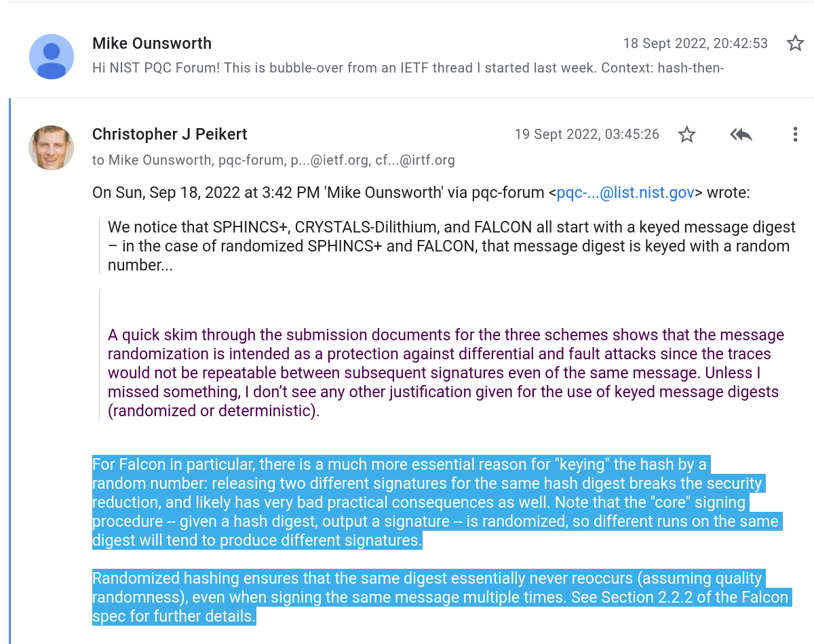
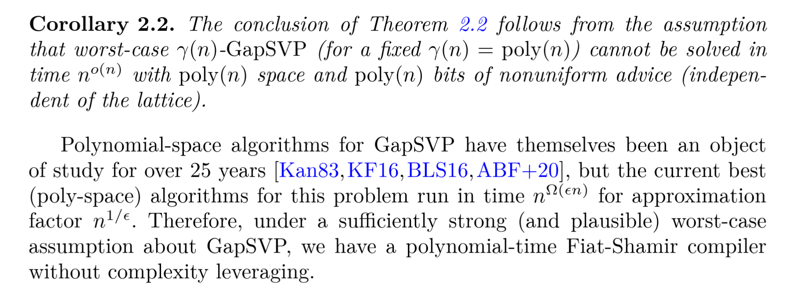
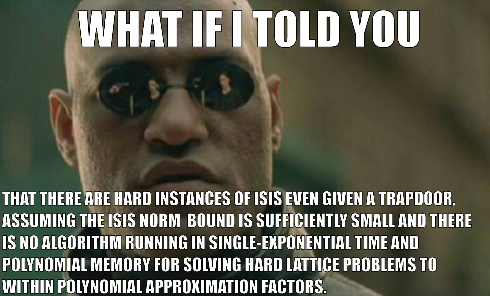

#+title: The space-time hardness of lattice problems
#+subtitle: 
#+options: H:2 num:t ':t
#+language: en-gb
#+select_tags: export
#+exclude_tags: noexport

#+latex_class: beamer
#+latex_class_options: [xcolor=table,10pt,aspectratio=169]
#+cite_export: biblatex

#+latex_header: \PassOptionsToPackage{british}{babel}
#+latex_header: \newtheorem{assumption}{Assumption}
#+latex_header: \mathchardef\mhyphen="2D
#+latex_header: \newcommand{\SIS}{\ensuremath{\mathsf{SIS}}\xspace}
#+latex_header: \newcommand{\ISIS}{\ensuremath{\mathsf{ISIS}}\xspace}
#+latex_header: \newcommand{\HISIS}{\ensuremath{\mathsf{H\pcmathhyphen{}ISIS}}\xspace}
#+latex_header: \newcommand{\HSIS}{\ensuremath{\mathsf{H\pcmathhyphen{}SIS}}\xspace}
#+latex_header: \newcommand{\params}{\mathsf{params}}
#+latex_header: \newcommand{\DIST}{\pcalgostyle{Dist}}
#+latex_header: \newcommand{\Exp}{\mathsf{Exp}}
#+latex_header: \newcommand{\ball}[2]{\ensuremath{\mathsf{B}^{#1}{(#2)}}}

#+macro: sout @@beamer:\sout{@@ $1 @@beamer:}@@
#+macro: tiny @@beamer:{\tiny@@ $1 @@latex:\par}@@
#+macro: fnsize @@beamer:{\footnotesize@@ $1 @@latex:\par}@@

#+author: Martin R. Albrecht
#+email: martin.albrecht@{kcl.ac.uk,sandboxquantum.com}
#+date: ICQCS'26 (20 March 2026)
#+startup: beamer

** Hardness of hinted ISIS from the space-time hardness of lattice problems

*** 
:PROPERTIES:
:BEAMER_col: 0.5
:END:

#+attr_latex: :height 0.6\textheight  :options keepaspectratio,frame

*** 
:PROPERTIES:
:BEAMER_col: 0.5
:END:

#+attr_latex: :height 0.6\textheight  :options keepaspectratio,frame

***                                                            :B_ignoreheading:
:PROPERTIES:
:BEAMER_env: ignoreheading
:END:

#+begin_center 
joint work with Russell W. F. Lai and Eamonn W. Postlethwaite\\
https://ia.cr/2026/187
#+end_center

** Motivation for those who like applications: Don't sign it twice!

*** 
:PROPERTIES:
:beamer_col: 0.65
:END:

#+attr_latex: :height .8\textheight  :options keepaspectratio,frame

{{{tiny(https://groups.google.com/a/list.nist.gov/g/pqc-forum/c/cIsc6tUY9Rw/m/E0fPG7QkAQAJ)}}}

*** 
:PROPERTIES:
:beamer_col: 0.35
:END:

*verification key*

\(\mat{A} \in \ZZ_{q}^{n \times m}\)

*signing key*

short \(\mat{T}\) s.t. \(\mat{A} \cdot \mat{T} \equiv \mat{0} \bmod q\)

*signature*

\((\vec{u},r)\) s.t. \(H(m,r) \equiv \mat{A} \cdot \vec{u} \bmod q\) with \(\vec{u}\) short

** Motivation for those who like lattices: An enticing lie

#+attr_latex: :height .8\textheight  :options keepaspectratio,frame

* Efficient Adversaries

** Some lattice problems and their relations

#+name: def:sivp
#+attr_latex: :options [\(\gamma\)-SIVP]
#+begin_definition
Given \(\gamma \ge 1\) and a full-rank lattice \(\Lambda \subset \RR^{n}\), find linearly independent \(\vec{v}_{1}, \ldots \vec{v}_{n}\) such that \(\max\norm{\vec{v}_i} \leq \gamma \cdot \lambda_{n}(\Lambda)\),  where \(\lambda _{n}(\Lambda)\) is the \(n\)-th successive minimum of ⁠\(\Lambda\).
#+end_definition

#+name: def:sis
#+attr_latex: :options [SIS (\cite{STOC:Ajtai96})]
#+begin_definition
Given a random \(\mat{A} \gets \ZZ_{q}^{n \times m}\), return \(\vec{u} \in \ZZ^{m}\) with \(0 < \norm{\vec{u}} \leq \beta\) such that \(\mat{A} \cdot \vec{u} \equiv \vec{0} \bmod q\).
#+end_definition

#+name: thm:sivp-sis
#+attr_latex: :options [SIVP \(\implies\) SIS~\cite{STOC:Ajtai96,SIAM:MicReg07}]
#+begin_theorem
Let \(m, \beta \in \poly[n]\), \(q \geq 8\,n\cdot\sqrt{m}\cdot\beta\) and \(\gamma = 8\, \beta\cdot\sqrt{n} \cdot \omega(\sqrt{\log n})\). Then solving SIS for \(n,m,q,\beta\) in time \(\tau\) and memory \(\mu\), solves \(\gamma\)-SIVP in time \(\tau + \poly[n]\) and memory \(\mu + \poly[n]\).
#+end_theorem

** Notation

Write
- \(\SIS_{n,m,q,\beta}\) to represent the SIS problem.
- \((\tau, \mu)\mhyphen\SIS_{n,m,q,\beta}\) for the set of algorithms that solve \(\SIS_{n,m,q,\beta}\) in time \(\tau\), memory \(\mu\) and with non-negligible success probability.
- \(\Lambda_{q}^{\bot}(\mat{A}) \coloneqq \{\vec{x} \in \ZZ^m : \mat{A} \cdot \vec{x} \equiv \vec{0} \bmod q\}\) for the kernel lattice of \(\mat{A}\). SIS asks to find short elements in this lattice.
- \(D_{\Lambda,s,\vec{c}}\) for the discrete Gaussian distribution with support \(\Lambda\), parameter \(s\) and centre \(\vec{c}\).
  
** "Let \(\adv\) be a {{{sout(PPT)}}}BQP adversary …"

#+name: ass:sis
#+attr_latex: :options [SIS]
#+begin_assumption
For sensible \(m,q,\beta \in \poly[n]\) we have \(\left(\poly[n],\allowbreak \poly[n]\right)\mhyphen\SIS_{n,m,q,\beta} = \emptyset\).
#+end_assumption

** "Let \(\adv\) be a subexponential adversary …"

#+name: ass:sis-subexponential
#+attr_latex: :options [Subexponential-secure SIS]
#+begin_assumption
For sensible \(m,q,\beta \in \poly[n]\) we have \(\left(2^{o(n)}, 2^{o(n)}\right)\mhyphen\SIS_{n,m,q,\beta} = \emptyset\).
#+end_assumption

** Algorithms for finding short vectors / solving SIS

*** 
:PROPERTIES:
:BEAMER_env: columns
:BEAMER_OPT: t
:END:

**** 
:PROPERTIES:
:BEAMER_env: column
:BEAMER_col: 0.5
:END:
_Enumeration_

- Search through vectors smaller than a given bound: project down to 1-dim problem, lift to 2-dim problem …
- _Time:_ \(n^{\Theta(n)}\)
- _Memory:_ \(\poly[n]\)

**** 
:PROPERTIES:
:BEAMER_env: column
:BEAMER_col: 0.5
:END:

_Sieving_

- Produce new, shorter vectors by considering sums and differences of existing vectors
- _Time:_ \(2^{\Theta(n)}\)
- _Memory:_ \(2^{\Theta(n)}\)
  
** Sieving I

#+begin_export latex
\tikzset{external/export=true}
\tikzsetnextfilename{sieving-idea-1}
\centering
\begin{tikzpicture}[scale=0.7, every node/.style={scale=0.7}]
  \coordinate (Origin)   at (0,0);

  \clip (-9,-5) rectangle (9,5);
  \pgftransformcm{1}{0.6}{0.7}{1}{\pgfpoint{0cm}{0cm}}

  \foreach \x in {-10,-9,...,10}{%
    \foreach \y in {-10,-9,...,10}{%
      \node[draw,circle,inner sep=1pt,fill] at (2*\x,2*\y) {};
    }
  }
  % \draw [ultra thick,-latex,red] (Origin)
  % -- (Bone) node [above left] {$b_1$};
  % \draw [ultra thick,-latex,red] (Origin)
  % -- (Btwo) node [below right] {$b_2$};

  \foreach \x in {-5,-3,2,4,5}{%
    \foreach \y in {-6,-4,1,4,5}{%
      \draw [thick,-latex,DarkBlue] (Origin)
      -- (2*\x,2*\y) {};
    }
  }

  \node [left] at (Origin) {$\mathcal{O}$};
\end{tikzpicture}
\tikzset{external/export=false}
#+end_export

** Sieving II

#+begin_export latex
\tikzset{external/export=true}
\tikzsetnextfilename{sieving-idea-2}
\centering
\begin{tikzpicture}[scale=0.7, every node/.style={scale=0.7}]
  \coordinate (Origin)   at (0,0);

  \clip (-9,-5) rectangle (9,5);
  \pgftransformcm{1}{0.6}{0.7}{1}{\pgfpoint{0cm}{0cm}}

  \foreach \x in {-10,-9,...,10}{%
    \foreach \y in {-10,-9,...,10}{%
      \node[draw,circle,inner sep=1pt,fill] at (2*\x,2*\y) {};
    }
  }

  \foreach \x in {-5,-3,2,4,5}{%
    \foreach \y in {-6,-4,1,4,5}{%
      \draw [thick,-latex,DarkBlue] (Origin)
      -- (2*\x,2*\y) {};
    }
  }

  \draw [ultra thick,-latex,LightRed] (Origin) -- (-10,10) {};
  \draw [ultra thick,-latex,LightRed] (Origin) -- (-10,8) {};

  \node [left] at (Origin) {$\mathcal{O}$};
\end{tikzpicture}
\tikzset{external/export=false}
#+end_export

** Sieving III

#+begin_export latex
\tikzset{external/export=true}
\tikzsetnextfilename{sieving-idea-3}
\centering
\begin{tikzpicture}[scale=0.7, every node/.style={scale=0.7}]
  \coordinate (Origin)   at (0,0);

  \clip (-9,-5) rectangle (9,5);
  \pgftransformcm{1}{0.6}{0.7}{1}{\pgfpoint{0cm}{0cm}}

  \coordinate (Bone) at (0,2);
  \coordinate (Btwo) at (2,-2);

  \foreach \x in {-10,-9,...,10}{%
    \foreach \y in {-10,-9,...,10}{%
      \node[draw,circle,inner sep=1pt,fill] at (2*\x,2*\y) {};
    }
  }

  \foreach \x in {-5,-3,2,4,5}{%
    \foreach \y in {-6,-4,1,4,5}{%
      \draw [thick,-latex,DarkBlue] (Origin)
      -- (2*\x,2*\y) {};
    }
  }

  \draw [ultra thick,-latex,LightRed] (Origin) -- (-10,10) {};
  \draw [ultra thick,-latex,LightRed] (Origin) -- (-10,8) {};
  \draw [ultra thick,-latex,LightBrown] (Origin) -- (0,-2) {};

  \node [left] at (Origin) {$\mathcal{O}$};
\end{tikzpicture}
\tikzset{external/export=false}
#+end_export

** Space-time hardness: cryptanalysis 
- "It is still unclear if we can get a \(2^{O(n)}\) algorithm that uses only polynomial space"[cite/footfull:@SODA:MicVou10]
- "is it possible to achieve exponential time complexity with a polynomially bounded space requirement?"[cite/footfull:@HanPujSte11]
- "A more general open problem is whether SVP can be solved in singly exponential time but only polynomial space."[cite/footfull:@STOC:ADRS15]

** Space-time hardness: conjecture

#+attr_latex: :height .6\textheight  :options keepaspectratio,frame

{{{fnsize([cite/full:@C:LomVai20])}}}

** A corollary

#+name: ass:space-time-sis
#+attr_latex: :options [Space-time hard SIS]
#+begin_assumption
For sensible \(m,q,\beta \in \poly[n]\) we have \(\left(2^{O(n)}, \poly[n]\right)\mhyphen\SIS_{n,m,q,\beta} = \emptyset\).
#+end_assumption

** A corollary (a specialisation)
#+name: ass:space-time-sis-m
#+attr_latex: :options [Space-time hard SIS]
#+begin_assumption
For sensible \(q,\beta \in \poly[n]\), \(m \in O(n)\) we have \(\left(\alert{\mathbf{2^{O(m)}}}, \poly[n]\right)\mhyphen\SIS_{n,m,q,\beta} = \emptyset\).
#+end_assumption

- When \(m \leq O(n)\) then \(2^{O(n)} = 2^{O(m)}\); we consider only this case in this talk.
- In the paper we also consider \(m \leq o(n \log n)\), which is covered by the conjecture.
- When \(m \ge \Omega(n \log n)\), there are algorithms in \(\left(2^{O(m)}, \poly[n]\right)\mhyphen\SIS_{n,m,q,\beta}\).

* Hinted lattice problems
** H-SIS

*** 
:PROPERTIES:
:beamer_col: 0.4
:END:

#+begin_export latex
\centering
\begin{pchstack}[center]
    \procedure[mode=text]{$\Exp\mhyphen\HISIS_{(k, m, q, \beta, s),\adv}(1^n)$}{
        \((\mat{A}, \vec{t}) \gets \ZZ_q^{n\times m} \times \ZZ_q^n\)\\
        \((\vec{u}_1, \dots, \vec{u}_k) \gets D_{\Lambda_q^\bot(\mat{A}),s,\vec{0}}\) \pccomment{\(\norm{\vec{u}_i} \approx s \sqrt{m}\)}\\
        \(\vec{u} \gets{} \adv(\mat{A}, \vec{t}, \vec{u}_1, \dots, \vec{u}_k)\)\\
        \pcreturn{ \(\llbracket{} \mat{A} \cdot \vec{u} = \vec{t} \land \norm{\vec{u}} \leq \beta \rrbracket{} \)}
    }
\end{pchstack}
#+end_export

*** 
:PROPERTIES:
:beamer_col: 0.6
:END:

- \(\beta \ge \Omega(\sqrt{m} \max \norm{\vec{u}_{i}})\): obviously easy: run Babai's Nearest Plane algorithm
- \(\beta \in O(1) \cdot \min \norm{\vec{u}_{i}}\): plausibly hard[cite/footfull:@CCS:AKSY22]

** Relation to motivations

*** 
:PROPERTIES:
:beamer_opt: t
:beamer_col: 0.5
:END:

#+attr_latex: :height .5\textheight  :options keepaspectratio,frame

Two signatures \(\vec{v}_{1}, \vec{v}_{2}\) for the same \((m,r)\) in Falcon, give \(\vec{v}_1 - \vec{v}_{2}\) s.t. \(\vec{v}_1 - \vec{v}_{2} \sim D_{\Lambda_q^\bot(\mat{A}),\sqrt{2}s,\vec{0}}\). Forgery means solving ISIS with similar norm.

*** 
:PROPERTIES:
:beamer_opt: t
:beamer_col: 0.5
:END:

#+attr_latex: :height .5\textheight  :options keepaspectratio,frame

This is precisely the H-ISIS problem.

* Reduction 
** Main result

*** Theorem

\(\left(2^{O(n)}, \poly[n]\right)\mhyphen {}\poly[n]\mhyphen {}SIVP = \emptyset\),\\
\(\implies\) There exists \(k,\beta,s\) such that \(\left(\poly[n], \poly[n]\right)\mhyphen\HISIS_{k,n,O(n),\poly[n],\beta,s} = \emptyset\).

** Geometry of sieves: ``There cannot be too many points in a ball that are far apart.''

*** 
:PROPERTIES:
:beamer_col: 0.5
:END:

#+name: lem:simple-point-bound
#+attr_latex: :options []
#+begin_lemma
Let \(S \subset \ball{m}{\beta}\). \\ 

If \(\abs{S} > 2^{m\log(1+2\gamma)}\), there exist distinct \(\vec{c}', \vec{c}'' \in S\) with \(\norm{\vec{c}' - \vec{c}''} \leq \beta/\gamma\).
#+end_lemma

_Remark:_ Cost estimates for lattice schemes such as Falcon or Kyber use a heuristic variant of this theorem.

*** 
:PROPERTIES:
:beamer_col: 0.5
:END:

#+begin_export latex
\centering
\begin{tikzpicture}[scale=0.35, every node/.style={scale=0.35}]
  \coordinate (Origin)   at (0,0);

  \clip (-9,-9) rectangle (9,9);
  \pgftransformcm{1}{0.6}{0.7}{1}{\pgfpoint{0cm}{0cm}}

  \coordinate (Bone) at (0,2);
  \coordinate (Btwo) at (2,-2);

  \foreach \x in {-10,-9,...,10}{%
    \foreach \y in {-10,-9,...,10}{%
      \node[draw,circle,inner sep=1pt,fill] at (2*\x,2*\y) {};
    }
  }

  \foreach \x in {-5,-3,2,4,5}{%
    \foreach \y in {-6,-4,1,4,5}{%
      \draw [thick,-latex,DarkBlue] (Origin)
      -- (2*\x,2*\y) {};
    }
  }

  \draw [ultra thick,-latex,LightRed] (Origin) -- (-10,10) {};
  \draw [ultra thick,-latex,LightRed] (Origin) -- (-10,8) {};
  \draw [ultra thick,-latex,LightBrown] (Origin) -- (0,-2) {};

  \node [left] at (Origin) {$\mathcal{O}$};
\end{tikzpicture}
#+end_export

** Probabilistic upgrade
:PROPERTIES:
:beamer_opt: t
:END:

#+name: lem:prob
#+attr_latex: :options [``No distribution over a ball can avoid close pairs.'']
#+begin_lemma
For _any (malicious) distribution_ \(D\) over \(\ball{m}{\beta}\) with finite support:
\[
\Pr_{\vec{c}', \vec{c}'' \gets D}\left[\norm{\vec{c}' - \vec{c}''} \leq \beta/\gamma\right] \geq \frac{1}{2^{m \log(1+2\gamma)}}.
\]
#+end_lemma

#+beamer: \pause

#+name: thm:motzkin-straus
#+attr_latex: :options [{Motzkin--Straus Theorem~\cite{Motzkin_Straus_1965}}]
#+begin_theorem
Let \(G\) be an undirected simple graph with adjacency matrix \(\mat{M}\).
\[
  \max_{\vec{d} \in [0,1]^n, \norm{\vec{d}}_1 = 1}\ \vec{d}^T \cdot \mat{M} \cdot \vec{d} = 1 - \frac{1}{\omega(G)}
\]
where \(\omega(G) = \max\{ \abs{X} \colon X \subseteq V \wedge (\forall (x,y \in X \wedge x \neq y),\, \{x,y\} \in E)\}\) is the clique number.
#+end_theorem

#+beamer: \pause

Define \(G\) so that \(\vec{c}\) and \(\vec{c}'\) are connected iff \(\norm{\vec{c}'-\vec{c}''} > \beta/\gamma\). Clique = "(anti-)cluster" of far-apart points. Apply Motzkin--Straus and geometry of sieves: \(\omega(G) \leq 2^{m \log(1+2\gamma)}\).

** A sieving algorithm

*** 
:PROPERTIES:
:beamer_col: 0.4
:beamer_opt: t
:END:

#+begin_export latex
\centering
\procedure[linenumbering,mode=text]{$\bdv^\adv(\mat{A}, \{\vec{u}_{i}\}_{1 \leq i \leq k})$}{%
\(s \coloneqq \beta/(2\gamma\sqrt{2m})\)\\
\pcfor{up to \(2^{O(m \cdot (1 + \log 4\gamma))}\) times}\\
\pcind \(\vec{v}_{\ell}, \vec{v}_{r} \gets D_{\ZZ^m,s} \times D_{\ZZ^m,s}\)\\
\pcind \(\vec{v}'_{\ell} \gets \adv(\mat{A}, \mat{A} \cdot \vec{v}_{\ell}, \{\vec{u}_{i}\}_{1 \leq i \leq k})\)\\
\pcind \(\vec{v}'_{r} \gets \adv(\mat{A}, \mat{A} \cdot \vec{v}_{r}, \{\vec{u}_{i}\}_{1 \leq i \leq k})\)\\
\pcind \pcif {\(\norm{\vec{v}'_{\ell} - \vec{v}'_{r}} \leq \beta/(2\gamma)\)}\\
\pcind \pcind \pcreturn \((\vec{v}_{\ell}-\vec{v}_{r}) - (\vec{v}'_{\ell} - \vec{v}'_{r})\)
}
#+end_export

*** 
:PROPERTIES:
:beamer_col: 0.6
:beamer_opt: t
:END:

#+beamer: \pause

- \(\gamma \in O(1) \implies 2^{O(m \cdot (1 + 4\gamma))} = 2^{O(m)}\)
- \(\vec{0} \equiv \mat{A} \cdot \left(\vec{v}_{i} - \vec{v}'_{i}\right) \bmod q\) for \(i \in \{\ell,r\}\)\\
 \(\implies \vec{0} \equiv \mat{A} \cdot (\vec{v}_{\ell}-\vec{v}_{r}) - (\vec{v}'_{\ell} - \vec{v}'_{r}) \bmod q\)
- \((\vec{v}_{\ell}-\vec{v}_{r}) - (\vec{v}'_{\ell} - \vec{v}'_{r}) \approx_{s} D_{\Lambda_q^\bot(\mat{A}), \sqrt{2}s, \vec{v}'_r-\vec{v}'_\ell}\)

** Cleaning up the output distribution

An adaptation of [cite:@AC:DFPS22] gives us:

- Have :: \(Q'_{(i,j)} \coloneqq D_{\Lambda_q^\bot(\mat{A}),s,\vec{v}'_i} - D_{\Lambda_q^\bot(\mat{A}),s,\vec{v}'_j}\)
- Close to :: \(Q_{(i,j)} \coloneqq D_{\Lambda_q^\bot(\mat{A}),\sqrt{2}s,\vec{v}'_i-\vec{v}'_j}\) with \(\Delta(Q'_{(i,j)}, Q_{(i,j)}) \leq 2^{-\Omega(m)}\)
- Want :: \(P_{i} \coloneqq D_{\Lambda_q^\bot(\mat{A}),\sqrt{2}s,0}\)
- Get :: \(P'_{i}\) with \(\Delta(P'_{i}, P_{i}) \leq 2^{-\Omega(m)}\) in \((\tau,\mu) = (2^{O(m)}, \poly[n])\) 
    

*** Punchline                                                     :B_alertblock:
:PROPERTIES:
:BEAMER_env: alertblock
:END:

We can "clean up" the distribution output by our sieve to be close to a zero-centred Gaussian like the hints but a constant factor \(\gamma\) shorter.

** Recursion

Assume there is a chain of such \(\{\bdv_{i}\}_{1 \leq i \leq z}\).

- Feed the outputs of \(\bdv_{i}\) to \(\bdv_{i+1}\) as hints.
- This allows us to make progress \(\gamma^{z} \ge 2^{\Omega(\poly[n])}\).
- Start the chain by sampling from a discrete Gaussian with \(s_{1} \in \omega(\log m) \cdot \sqrt{m} \cdot q\) -- which is easy -- to produce the required initial hints.

** Stopping condition

At some point, this process has to stop working, because there simply cannot be some \(\bdv_{z}\) for the required parameters, in particular \(\beta_{z}\).

- We establish that when
  \[
  \beta_{z} \ge \Omega(m) \cdot \lambda_{m}(\Lambda_q^{\bot}(\mat{A}))
  \]
  then a polynomially number of Gaussians sampled by \(\bdv_{z}\) will span the entire lattice with overwhelming probability.
- We also establish that
  \[
  \lambda_{m}(\Lambda_q^{\bot}(\mat{A})) \in O(\sqrt{\log m}) \cdot \lambda_{1}(\Lambda_q^{\bot}(\mat{A})),
  \]
  suggesting that such a best-case \(\adv_{z}\) would sample solutions within a factor of \(O(m \cdot \sqrt{\log m})\) from optimal: \(\lambda_{1}(\Lambda_q^{\bot}(\mat{A}))\).

** Caveats

- In general, we cannot derive the existence of \(\bdv_{i+1}\) from \(\bdv_{i}\)
- It is not a given that \(\bdv_{i}\) and \(\bdv_{i+1}\) "agree" on which \(\mat{A}\) they accept as inputs, i.e. succeed on them.

** Some H-ISIS must be hard if lattices are space-time hard

For a given \(\mat{A} \gets \ZZ_{q}^{n \times m}\):

- Either :: The H-ISIS instances for all parameters \(\{(m,n,q,\beta_{i},s_i)\}_{1 \leq i \leq z}\) are easy,
   + which implies SIS for \(\mat{A}\) is space-time easy,
   + which means worst-case lattice problems are space-time easy
- Or :: H-ISIS is hard for at least one set of the parameters \((m,n,q,\beta_{j},s_j)\)
   + but our reduction does not establish which \(j\), i.e. we do not formally establish that the problem does not get easier as norm bounds shrink.

** Fin
:PROPERTIES:
:BEAMER_OPT: standout
:END:

#+attr_latex: :height .9\textheight  :options keepaspectratio

** References
:PROPERTIES:
:BEAMER_opt: allowframebreaks
:END:

#+begin_export latex
\printbibliography[heading=none]
#+end_export

#+begin_export latex
\IfFileExists{\jobname.tex}{\embedfile[afrelationship={/Source}]{\jobname.tex}}{}
#+end_export

#+begin_export latex
\appendix
#+end_export

* Enumeration
** Enumeration I -- Pick a radius

[[./assets/lattice-enumeration-0-radius.pdf]]

{{{tiny(Picture credit: Joop van de Pol)}}}

** Enumeration II -- Project basis

[[./assets/lattice-enumeration-1-project.pdf]]

{{{tiny(Picture credit: Joop van de Pol)}}}

** Enumeration III -- Project lattice

[[./assets/lattice-enumeration-2-project.pdf]]

{{{tiny(Picture credit: Joop van de Pol)}}}

** Enumeration IV -- Enumerate projections

[[./assets/lattice-enumeration-3-enumerate.pdf]]

{{{tiny(Picture credit: Joop van de Pol)}}}

** Enumeration V -- For each lift and enumerate

[[./assets/lattice-enumeration-4-lift.pdf]]

{{{tiny(Picture credit: Joop van de Pol)}}}

** Enumeration V -- For each lift and enumerate

[[./assets/lattice-enumeration-5-lift.pdf]]

{{{tiny(Picture credit: Joop van de Pol)}}}

** Enumeration VI -- Keep shortest 

[[./assets/lattice-enumeration-6-keep.pdf]]

{{{tiny(Picture credit: Joop van de Pol)}}}

** Technical Artefacts                                                :noexport:

# Local Variables:
# org-tags-column: -80
# eval: (add-hook 'after-save-hook #'org-beamer-export-to-latex nil t)
# eval: (visual-fill-column-mode t)
# eval: (adaptive-wrap-prefix-mode t)
# eval: (typo-mode -1)
# eval: (smartparens-mode 1)
# eval: (org-cdlatex-mode 1)
# End:
